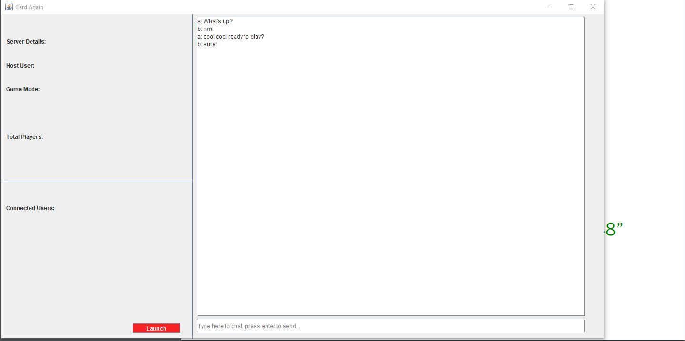

# Card Again

Card Again is multiplayer game written in javascript and php.  Me and 3 other people all work on the game as a semster long project for the class Com S 309 at Iowa State.  I helped write the database and GUI. The php and networking side was mainly written by my other two parthers.  The game logic was done by another partner. During the end when the game logic, GUI, database where all done, we all helped with debugging the networking side of the program as that was the hardest part of the project.

Here are a few images of what the program looks like.

Chat

Go Fish

War

Leader Board

Main

Main 2

Server

Server 2

Settings

Sign Up

